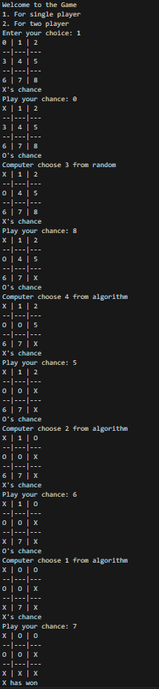
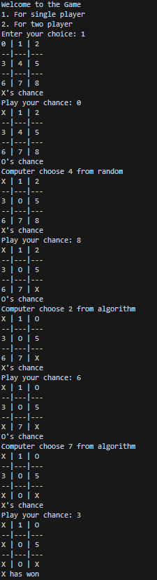

# Tic-Tac-Toe in python
I create this game a time ago it was not capable of making decision to place it's chance but now it is able to think and place it's chance and try to move towards a win 

## New Sample
 

In future,I want to add a GUI to the game as well using Tkinter.